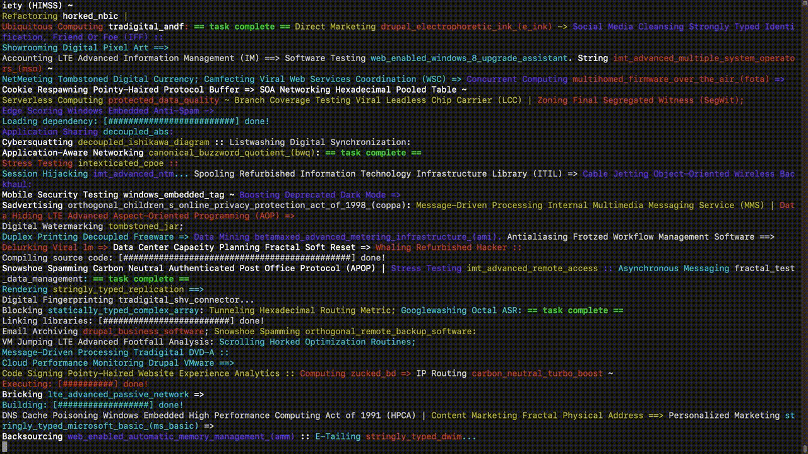
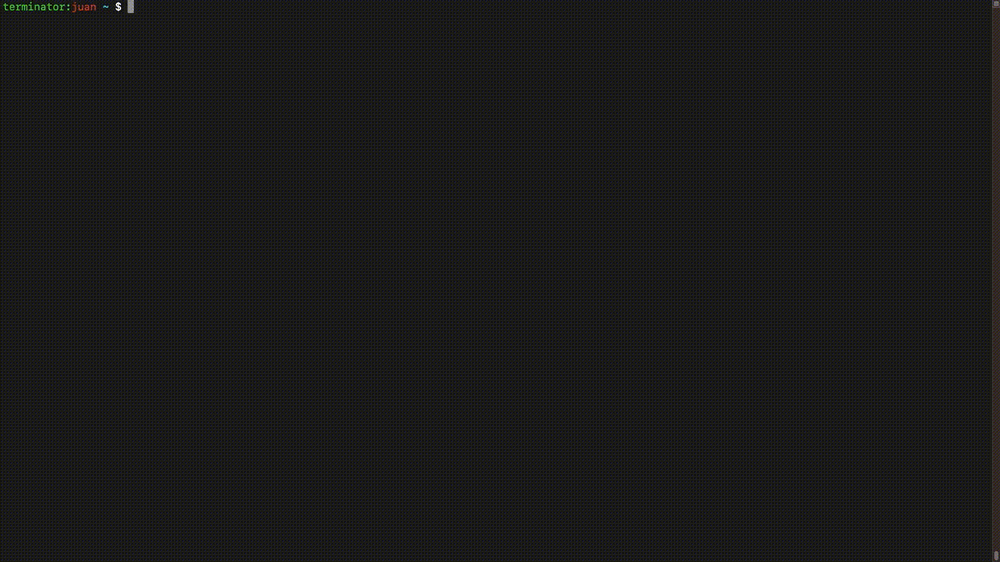

# tjargon - A Random Tech Jargon Generator

This is an npm package that generates random tech jargon.

## How it works
I basically just scraped [Techopedia's](https://www.techopedia.com) dictionary of IT terms and pushed them into a text file. Then, I split the terms up by their suffixes to crudely divide them up into verbs, adjectives and nouns. These are put together into random sequences to generate "tech jargon".



## Installation

Install globally with npm:
```
npm install tjargon -g
```


